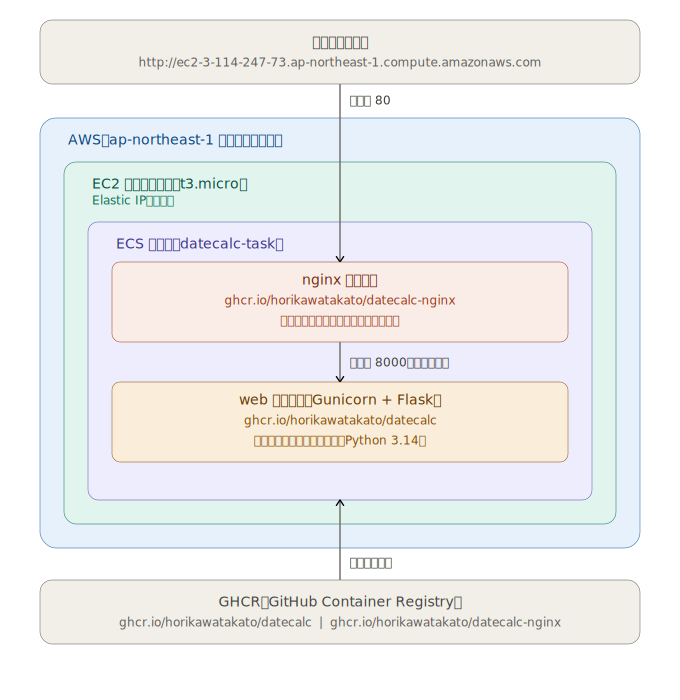

# 日数計算機

現在の日付と入力した日付の差分を計算するWebアプリケーションです。  
AWS ECS on EC2 でコンテナ運用し、GitHub Actions による CI/CD を構築しています。  

---

## 主な機能

- 現在の日付と入力した日付の差分を日数で表示（365日以上は年数も併記）
- 紀元前999年から西暦9999年まで対応
- 紀元前の年は負数で入力（例：-100年1月1日 = 紀元前100年1月1日）
- 曜日の表示
- 計算履歴の表示（最大8件、重複は自動排除）

---

## ファイル構成

```
datecalc/
├── .github/
│   └── workflows/
│       └── build-push.yml      # GitHub Actions：テスト・ビルド・ECS 自動デプロイ
├── app/
│   ├── DateCalc.html           # Web フロントエンド
│   ├── DateCalc.py             # 計算ロジック
│   ├── DateCalc_server.py      # Flask Web サーバー（API）
│   ├── Dockerfile
│   ├── gunicorn.conf.py        # Gunicorn 設定
│   ├── requirements.txt        # 依存パッケージ（Flask・Gunicorn）
│   ├── test_DateCalc.py        # ユニットテスト（pytest）
│   └── wsgi.py                 # Gunicorn エントリポイント
├── nginx/
│   ├── Dockerfile              # カスタム Nginx イメージ用
│   └── nginx.conf              # リバースプロキシ設定
├── .gitignore                  # Git 管理除外設定
├── LICENSE                     # MITライセンス
├── README.md                   # プロジェクト説明
├── container-architecture.svg  # コンテナ構成図
├── docker-compose.yml          # コンテナ構成定義（ローカル開発用）
└── task-definition.json        # AWS ECS タスク定義
```

---

## コンテナ構成



---

## CI/CD（GitHub Actions + GitHub Container Registry + AWS ECS on EC2）

main ブランチへ Push すると `.github/workflows/build-push.yml` が起動し、test → build-and-push → deploy の3ジョブが順番に自動で実行されます。

### ワークフロー

---

**【test ジョブ】**

1. **Python 3.14 をセットアップ**  
   `actions/setup-python` で指定バージョンの Python 環境を構築します。


2. **依存パッケージをインストール**  
   `requirements.txt` をもとに Flask・Gunicorn などの依存パッケージをインストールします。


3. **pytest によるユニットテスト実行**  
   `test_DateCalc.py` に定義されたテスト（全42件）を実行し、計算ロジックの正確性を検証します。  
   （※）テストが1件でも失敗した場合、後続のジョブは実行されず処理が停止します。

---

**【build-and-push ジョブ】**

4. **GitHub Container Registry へ自動ログイン**  
   `docker/login-action` を使い、GitHub のシークレットに保存したトークンで GitHub Container Registry（GHCR）へ認証します。


5. **app イメージをビルド＆Push**  
   `app/Dockerfile` をもとに Flask アプリ（Gunicorn）のイメージをビルドし、`ghcr.io/horikawatakato/datecalc` へ Push します。


6. **nginx イメージをビルド＆Push**  
   `nginx/Dockerfile` をもとにカスタム Nginx イメージをビルドし、`ghcr.io/horikawatakato/datecalc-nginx` へ Push します。


7. **タグを自動生成**  
   `docker/metadata-action` によって以下の3種類のタグが自動的に付与されます。
   - `latest`：常に最新イメージを指す
   - `sha-xxxxxxx`：コミット SHA によるイメージの一意な識別
   - ブランチ名（例：`main`）：ブランチ単位での追跡

---

**【deploy ジョブ】**

8. **AWS OIDC 認証**  
   `configure-aws-credentials` アクションで IAM ロール（`GitHubActionsECSDeployRole`）を引き受けます。アクセスキーを使わない OIDC 認証のため、シークレット漏洩リスクを排除できます。


9. **実行中の古い ECS タスクを停止**  
   EC2 起動タイプでは同一ポートを複数タスクで同時使用できないため、先に既存タスクを明示的に停止してポート 80 を解放します。


10. **ECS タスク定義を新しいイメージで更新**  
    `task-definition.json` の web・nginx 各コンテナのイメージタグを、直前の Push で生成した最新の SHA タグに書き換えて新リビジョンを登録します。


11. **ECS サービスにデプロイ・安定確認**  
    更新したタスク定義を `datecalc-service` に適用し、`ecs deploy` コマンドがタスクの RUNNING 状態への遷移を確認するまで待機します（所要時間：約3〜6分）。

---

## AWS ECS 構成

### リソース一覧

| リソース | 名前 | 備考 |
|---|---|---|
| ECS クラスター | `datecalc-cluster` | EC2 起動タイプ |
| ECS サービス | `datecalc-service` | タスク数：1 |
| ECS タスク定義 | `datecalc-task` | 2コンテナ構成 |
| EC2 インスタンス | `t3.micro` | 無料枠対象 |
| Elastic IP | `3.114.247.73` | EC2 再起動後も IP 固定 |
| IAM ロール（デプロイ用） | `GitHubActionsECSDeployRole` | OIDC 認証 |
| IAM ロール（タスク実行用） | `ecsTaskExecutionRole` | イメージ Pull 用 |
| CloudWatch Logs | `/ecs/datecalc` | コンテナログ |
| リージョン | `ap-northeast-1` | 東京リージョン |

### タスク定義

| コンテナ名 | イメージ | ポート | メモリ |
|---|---|---|---|
| web | `ghcr.io/horikawatakato/datecalc` | 8000（内部のみ） | 200MB |
| nginx | `ghcr.io/horikawatakato/datecalc-nginx` | 80（外部公開） | 100MB |

## License: MIT
